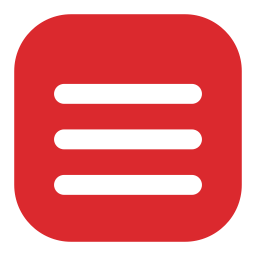
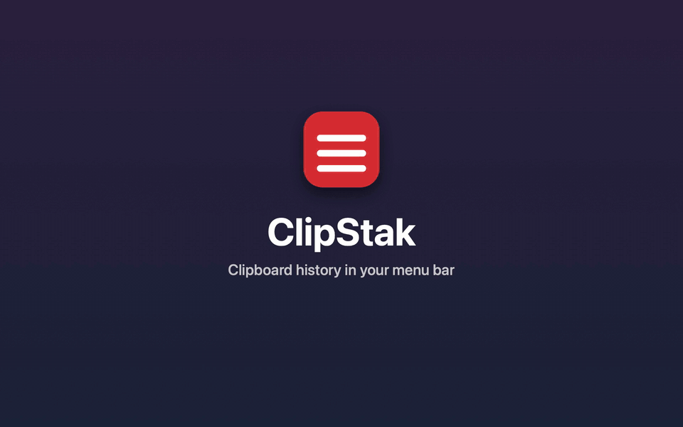

#  ClipStak



ClipStak is a menu-bar clipboard history for macOS. Copy as usual. Hold Shift-Command-V to show the newest clip, press the shortcut again to walk older, and release to paste into the app you were using. Esc cancels. Control-Command-V shows every clip in a grid instead: click one, or move with the arrow keys and press Return, to paste it. Esc closes the grid.

The release is an Apple silicon app for macOS 14 or later. It is not notarized.

## Install a release

1. Download `ClipStak-1.0.0.zip` from [the latest release](https://github.com/bsharpe/ClipStak/releases/latest).
2. Unzip it and move `ClipStak.app` to `/Applications`.
3. Clear the download quarantine, or macOS will report that the app is damaged:

   ```bash
   xattr -dr com.apple.quarantine /Applications/ClipStak.app
   ```

4. Open ClipStak. It has no window. A red icon with three white lines appears in the menu bar.
5. Allow ClipStak in System Settings → Privacy & Security → Accessibility. You can open this pane from ClipStak's **Enable Automatic Paste…** menu item. Paste does nothing until that is on. Capture and the menu work without it.

If ClipStak is enabled there but automatic paste still does nothing after an update, remove its entry with the minus button, add the app you actually run with the plus button, and enable it again. Quit and reopen ClipStak afterward. A permission entry for an older unsigned build can remain enabled without authorizing the current signed app.

History is kept in `~/Library/Application Support/ClipStak/history.json`. The menu shows the last 10 clips. Option-click the icon, or choose Pause Capture, before copying a password. Sticky Bezel, in the menu, keeps the card up until you press Return or Esc.

Text and copied PNG/TIFF images share a history of up to 40 clips. Images have thumbnails in the menu and bezel, with their pixel dimensions shown in the menu. They paste into apps that accept images. Existing text history loads automatically, and concealed or transient clipboard entries are skipped.

Images are saved as private PNG files in `~/Library/Application Support/ClipStak/images/`. Each image is limited to 40 megapixels and 10 MiB after conversion to PNG; incoming image data is limited to 64 MiB. The app drops the oldest clips when image history exceeds 100 MiB. Deleting or clearing clips removes unused image files. If a malformed history file has been preserved for recovery, its image files are kept until that backup is removed.

Quit ClipStak from the menu and it stays quit. Opening the app again starts it. A crash does not start it again unless you add the login agent below.

## Start at login

Quit ClipStak first if it is already open. Save this as `~/Library/LaunchAgents/com.bsharpe.clipstak.plist`. The path inside it must be the copy you open.

```xml
<?xml version="1.0" encoding="UTF-8"?>
<!DOCTYPE plist PUBLIC "-//Apple//DTD PLIST 1.0//EN" "http://www.apple.com/DTDs/PropertyList-1.0.dtd">
<plist version="1.0">
<dict>
	<key>Label</key>
	<string>com.bsharpe.clipstak</string>
	<key>ProgramArguments</key>
	<array>
		<string>/Applications/ClipStak.app/Contents/MacOS/ClipStak</string>
	</array>
	<key>RunAtLoad</key>
	<true/>
	<key>KeepAlive</key>
	<dict>
		<key>SuccessfulExit</key>
		<false/>
	</dict>
	<key>LimitLoadToSessionType</key>
	<string>Aqua</string>
	<key>ProcessType</key>
	<string>Interactive</string>
</dict>
</plist>
```

```bash
launchctl bootstrap gui/$(id -u) ~/Library/LaunchAgents/com.bsharpe.clipstak.plist
```

A crash then relaunches ClipStak. Quit from the menu stays quit until the next login. To stop the agent:

```bash
launchctl bootout gui/$(id -u)/com.bsharpe.clipstak
```

## Build from source

Install Xcode, then:

```bash
git clone https://github.com/bsharpe/ClipStak.git
cd ClipStak
./scripts/build-app.sh
```

That runs the tests, builds a release binary, and installs `~/Applications/ClipStak.app`. The script signs it ad hoc, which is enough on your own Mac and is not enough for Gatekeeper on someone else's.
